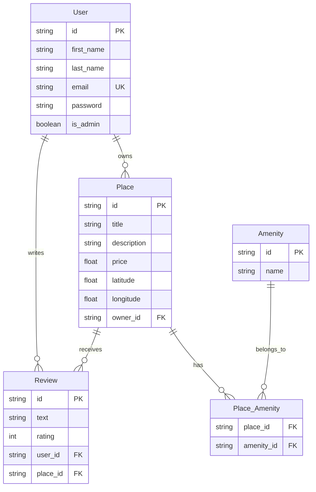

# HBnB Project - Database Schema

## Entity Relationship Diagram (ERD)

##  Database Schema Explanation

### **1. User Table**
| Field | Type | Description |
|-------|------|-------------|
| `id` | string PK | Unique identifier for each user |
| `first_name` | string | User's first name |
| `last_name` | string | User's last name |
| `email` | string UK | Email address (unique) |
| `password` | string | Hashed password |
| `is_admin` | boolean | Admin privileges flag |

**Relationships:**
-  User → Place: **One-to-Many** (A user can own multiple places)
-  User → Review: **One-to-Many** (A user can write multiple reviews)

---

### **2. Place Table**
| Field | Type | Description |
|-------|------|-------------|
| `id` | string PK | Unique identifier for each place |
| `title` | string | Place title/name |
| `description` | string | Detailed description |
| `price` | float | Price per night |
| `latitude` | float | Geographic latitude |
| `longitude` | float | Geographic longitude |
| `owner_id` | string FK | Reference to User (owner) |

**Relationships:**
-  Place → Review: **One-to-Many** (A place can receive multiple reviews)
-  Place → Place_Amenity: **One-to-Many** (A place can have multiple amenities)

---

### **3. Review Table**
| Field | Type | Description |
|-------|------|-------------|
| `id` | string PK | Unique identifier for each review |
| `text` | string | Review content |
| `rating` | int | Rating (1-5 stars) |
| `user_id` | string FK | Reference to User (reviewer) |
| `place_id` | string FK | Reference to Place |

**Relationships:**
-  Review → User: **Many-to-One** (Each review belongs to one user)
-  Review → Place: **Many-to-One** (Each review belongs to one place)

---

### **4. Amenity Table**
| Field | Type | Description |
|-------|------|-------------|
| `id` | string PK | Unique identifier for each amenity |
| `name` | string | Amenity name (e.g., WiFi, Parking, AC) |

**Relationships:**
- Amenity → Place_Amenity: **One-to-Many** (An amenity can be in multiple places)

---

### **5. Place_Amenity Table (Junction Table)**
| Field | Type | Description |
|-------|------|-------------|
| `place_id` | string FK | Reference to Place |
| `amenity_id` | string FK | Reference to Amenity |

This junction table handles the **Many-to-Many** relationship between Place and Amenity:
-  One place can have multiple amenities
-  One amenity can belong to multiple places

---

## **Relationship Keys Legend**

| Symbol | Meaning |
|--------|---------|
| `PK` | Primary Key  |
| `FK` | Foreign Key  |
| `UK` | Unique Key  |
| `\|` | Exactly one  |
| `o{` | Zero or more  |

---

## **Summary of Relationships**

| Relationship | Type | Description |
|--------------|------|-------------|
| User - Place | One-to-Many | One user can own many places |
| User - Review | One-to-Many | One user can write many reviews |
| Place - Review | One-to-Many | One place can receive many reviews |
| Place - Amenity | Many-to-Many | Many places can have many amenities (via Place_Amenity) |

---

*This diagram was created using Mermaid.js*